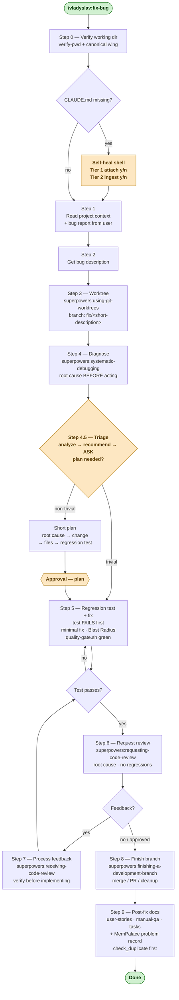

# fix-bug lifecycle

Self-heal shell (if missing) → diagnose → triage (plan when non-trivial) → test-first fix → review → merge → docs + MemPalace.

```mermaid
flowchart TD
    A([/vladyslav:fix-bug]):::start
    A --> S0[Step 0 — Verify working dir<br/>verify-pwd + canonical wing]
    S0 --> H0{CLAUDE.md missing?}
    H0 -- yes --> SH[Self-heal shell<br/>Tier 1 attach y/n<br/>Tier 2 ingest y/n]:::approval
    SH --> S1
    H0 -- no --> S1[Step 1<br/>Read project context<br/>+ bug report from user]
    S1 --> S2[Step 2<br/>Get bug description]
    S2 --> S3[Step 3 — Worktree<br/>superpowers:using-git-worktrees<br/>branch: fix/&lt;short-description&gt;]
    S3 --> S4[Step 4 — Diagnose<br/>superpowers:systematic-debugging<br/>root cause BEFORE acting]
    S4 --> T{Step 4.5 — Triage<br/>analyze → recommend → ASK<br/>plan needed?}:::approval
    T -- trivial --> S5
    T -- non-trivial --> PLAN[Short plan<br/>root cause → change<br/>→ files → regression test]
    PLAN --> AP{{Approval — plan}}:::approval
    AP --> S5[Step 5 — Regression test + fix<br/>test FAILS first<br/>minimal fix · Blast Radius<br/>quality-gate.sh green]
    S5 --> S6{Test passes?}
    S6 -- no --> S5
    S6 -- yes --> S7[Step 6 — Request review<br/>superpowers:requesting-code-review<br/>root cause · no regressions]

    S7 --> Q1{Feedback?}
    Q1 -- yes --> S8[Step 7 — Process feedback<br/>superpowers:receiving-code-review<br/>verify before implementing]
    S8 --> S6
    Q1 -- no / approved --> S9[Step 8 — Finish branch<br/>superpowers:finishing-a-development-branch<br/>merge / PR / cleanup]

    S9 --> S10[Step 9 — Post-fix docs<br/>user-stories · manual-qa · tasks<br/>+ MemPalace problem record<br/>check_duplicate first]
    S10 --> END([Done]):::done

    classDef start fill:#d0f0d0,stroke:#006600,color:#003300,font-weight:bold
    classDef done fill:#d0f0d0,stroke:#006600,color:#003300,font-weight:bold
    classDef approval fill:#fde7c2,stroke:#a87000,color:#5a3a00,font-weight:bold
```
