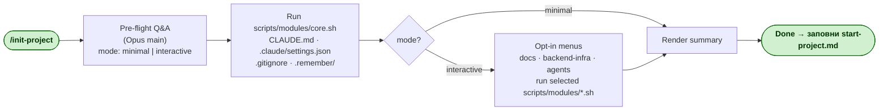
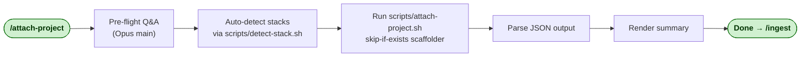
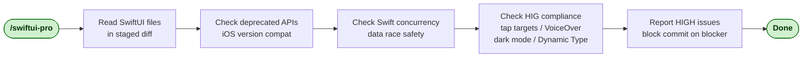
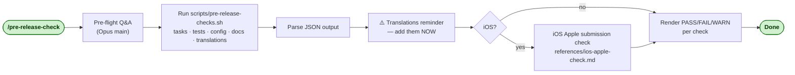
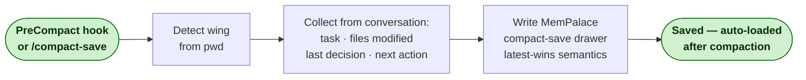
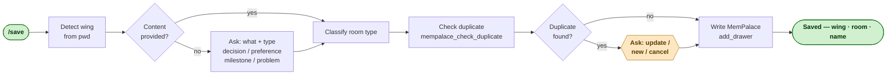

# Skill Flows

Simplified lifecycle diagrams for all 17 skills. Render natively on GitHub.

---

## Setup Skills

### init-project — Bootstrap new project from scratch

```mermaid
flowchart LR
    A([/init-project]):::start --> B["Pre-flight Q&A<br/>(Opus main)<br/>mode: minimal | interactive"]
    B --> C["Run scripts/modules/core.sh<br/>CLAUDE.md · .claude/settings.json<br/>.gitignore · .remember/"]
    C --> D{mode?}
    D -- minimal --> F[Render summary]
    D -- interactive --> E["Opt-in menus<br/>docs · backend-infra · agents<br/>run selected scripts/modules/*.sh"]
    E --> F
    F --> G([Done → заповни start-project.md]):::done

    classDef start fill:#d0f0d0,stroke:#006600,color:#003300,font-weight:bold
    classDef done  fill:#d0f0d0,stroke:#006600,color:#003300,font-weight:bold
```

---

### attach-project — Add Claude structure to existing project

```mermaid
flowchart LR
    A([/attach-project]):::start --> B["Pre-flight Q&A<br/>(Opus main)"]
    B --> C[Auto-detect stacks<br/>via scripts/detect-stack.sh]
    C --> D[Run scripts/attach-project.sh<br/>skip-if-exists scaffolder]
    D --> E[Parse JSON output]
    E --> F[Render summary]
    F --> G([Done → /ingest]):::done

    classDef start fill:#d0f0d0,stroke:#006600,color:#003300,font-weight:bold
    classDef done  fill:#d0f0d0,stroke:#006600,color:#003300,font-weight:bold
```

---

### ingest — Single-pass project intake (architecture docs + MemPalace)

```mermaid
flowchart LR
    A([/ingest]):::start --> B["Verify pwd<br/>(verify-pwd.md)"]
    B --> C["scripts/scan-architecture.sh<br/>→ ARCH JSON"]
    C --> D["scripts/gather-seed-signals.sh<br/>→ SIGNALS JSON"]
    D --> E[Check existing<br/>MemPalace state]
    E --> F[Write architecture docs<br/>system.md / api.md / db-schema.sql]
    F --> G[Extract 10-20<br/>MemPalace records]
    G --> H[Update CLAUDE.md<br/>Memory pointer]
    H --> I([Done → /add-feature]):::done

    classDef start fill:#d0f0d0,stroke:#006600,color:#003300,font-weight:bold
    classDef done  fill:#d0f0d0,stroke:#006600,color:#003300,font-weight:bold
```

---

## Build Skills

### add-feature — Full feature lifecycle (design → plan → implement → merge)

```mermaid
flowchart LR
    A([/add-feature]):::start --> B[Read CLAUDE.md\narchitecture / PRD / tasks]
    B --> C[Get feature description]
    C --> D[Create worktree]
    D --> E[Brainstorm design]
    E --> AP1{{Approve design}}:::approval
    AP1 --> F[Define contract\ntypes + examples + errors]
    F --> AP2{{Approve contract}}:::approval
    AP2 --> G{Large feature?}
    G -- yes --> H[Generate roadmap\ndocs/roadmap/slug.md\nphases + done-when]
    G -- no  --> I[Write implementation plan]
    H --> I
    I --> AP3{{Approve plan}}:::approval
    AP3 --> J[Execute plan\nsubagents · parallel agents\nguard rails + auto-gate]
    J --> K[Code review]
    K --> L[Merge to dev]
    L --> M([Architect report\n→ /write-docs]):::done

    classDef start    fill:#d0f0d0,stroke:#006600,color:#003300,font-weight:bold
    classDef done     fill:#d0f0d0,stroke:#006600,color:#003300,font-weight:bold
    classDef approval fill:#fde7c2,stroke:#a87000,color:#5a3a00,font-weight:bold
```

---

### fix-bug — Full bug fix lifecycle (reproduce → fix → review → merge)

```mermaid
flowchart LR
    A([/fix-bug]):::start --> SH[Self-heal shell\nif no CLAUDE.md]:::approval
    SH --> B[Read project + bug report]
    B --> C[Create worktree\nbranch: fix/description]
    C --> D[Diagnose\nsystematic debugging]
    D --> TR{Triage\nplan if non-trivial}:::approval
    TR --> E[Write failing test\nTDD — test MUST fail first]
    E --> F[Fix root cause\nnot symptom]
    F --> G{Tests pass?}
    G -- no  --> F
    G -- yes --> H[Code review\nno regressions\nedge cases covered]
    H --> I{Feedback?}
    I -- yes --> F
    I -- no  --> J[Merge + MemPalace\nproblem record]
    J --> K([Done → /write-docs]):::done

    classDef start fill:#d0f0d0,stroke:#006600,color:#003300,font-weight:bold
    classDef done  fill:#d0f0d0,stroke:#006600,color:#003300,font-weight:bold
    classDef approval fill:#fde7c2,stroke:#a87000,color:#5a3a00,font-weight:bold
```

---

### swiftui-pro — SwiftUI-specific code review

```mermaid
flowchart LR
    A([/swiftui-pro]):::start --> B[Read SwiftUI files\nin staged diff]
    B --> C[Check deprecated APIs\niOS version compat]
    C --> D[Check Swift concurrency\ndata race safety]
    D --> E[Check HIG compliance\ntap targets / VoiceOver\ndark mode / Dynamic Type]
    E --> F[Report HIGH issues\nblock commit on blocker]
    F --> G([Done]):::done

    classDef start fill:#d0f0d0,stroke:#006600,color:#003300,font-weight:bold
    classDef done  fill:#d0f0d0,stroke:#006600,color:#003300,font-weight:bold
```

---

## Docs, Ship and Memory Skills

### write-docs — one menu-driven skill for stories / tests / project docs

Merged from write-user-stories + write-test-docs + write-project-docs in v5.0.0.
Flow: pre-flight (CLAUDE.md + mode + required inputs) → read inputs in full →
generate (stories inline; tests = 2 parallel sonnet agents; project = 3 parallel
sonnet agents + no-AI-mention gate) → summary.

### pre-release-check — Final gate before production

```mermaid
flowchart LR
    A([/pre-release-check]):::start --> B["Pre-flight Q&A<br/>(Opus main)"]
    B --> C[Run scripts/pre-release-checks.sh<br/>tasks · tests · config · docs · translations]
    C --> D[Parse JSON output]
    D --> E["⚠️ Translations reminder<br/>— add them NOW"]
    E --> F{iOS?}
    F -- yes --> G["iOS Apple submission check<br/>references/ios-apple-check.md"]
    F -- no  --> H[Render PASS/FAIL/WARN<br/>per check]
    G --> H
    H --> I([Done]):::done

    classDef start fill:#d0f0d0,stroke:#006600,color:#003300,font-weight:bold
    classDef done  fill:#d0f0d0,stroke:#006600,color:#003300,font-weight:bold
```

---

### compact-save — Snapshot task state before context compaction

```mermaid
flowchart LR
    A([PreCompact hook\nor /compact-save]):::start --> B[Detect wing\nfrom pwd]
    B --> C[Collect from conversation:\ntask · files modified\nlast decision · next action]
    C --> D[Write MemPalace\ncompact-save drawer\nlatest-wins semantics]
    D --> E([Saved — auto-loaded\nafter compaction]):::done

    classDef start fill:#d0f0d0,stroke:#006600,color:#003300,font-weight:bold
    classDef done  fill:#d0f0d0,stroke:#006600,color:#003300,font-weight:bold
```

---

### save — Save a knowledge record to MemPalace

```mermaid
flowchart LR
    A([/save]):::start --> B[Detect wing\nfrom pwd]
    B --> C{Content\nprovided?}
    C -- no --> D[Ask: what + type\ndecision / preference\nmilestone / problem]
    C -- yes --> E[Classify room type]
    D --> E
    E --> F[Check duplicate\nmempalace_check_duplicate]
    F --> G{Duplicate\nfound?}
    G -- yes --> H{{Ask: update /\nnew / cancel}}:::approval
    G -- no  --> I[Write MemPalace\nadd_drawer]
    H --> I
    I --> J([Saved — wing · room · name]):::done

    classDef start    fill:#d0f0d0,stroke:#006600,color:#003300,font-weight:bold
    classDef done     fill:#d0f0d0,stroke:#006600,color:#003300,font-weight:bold
    classDef approval fill:#fde7c2,stroke:#a87000,color:#5a3a00,font-weight:bold
```
